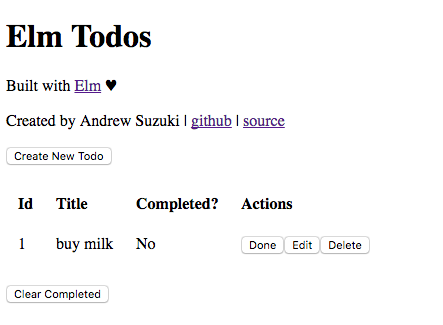

# elm-todo-rest-api



The official [elm-todomvc](https://github.com/evancz/elm-todomvc) uses localStorage to persist state. Since most
real-world elm apps will interact with a web api to persist state,
this is a simple elm todo app demonstrating interaction
with a simple json api server.

Additionally, the code here has about 10x the modularity of the official implementation.

This app is sparse on css on purpose.

The code is heavily-documented. If something is confusing,
submit an issue or PR and I'll improve the documentation there if possible.

## Beginners

I recommend following roughly this order for checking out the code:

`Main → Models → Messages → Update → View`

then in the `Todos` directory:

`Todos.[Models → Messages → Update → Commands → View → Edit]`

then if you're feeling confident:

`Utils`

## Getting Started

If you haven't installed Elm 0.18 yet, do so [here](http://elm-lang.org/install).

elm-todo-rest-api 0.2.0 is compatible with **Elm 0.18**. If you're still on Elm 0.17, download elm-todo-rest-api 0.1.0 [here](https://github.com/andrewsuzuki/elm-todo-rest-api/releases/tag/0.1.0).

First, clone this repository:

```
$ git clone https://github.com/andrewsuzuki/elm-todo-rest-api.git
$ cd elm-todo-rest-api
```

Then install dependencies:

```
$ npm install
$ elm package install
```

To play with the app, first start up the api:

```
$ npm run api
```

All changes will be reflected in `db.json`.

Then, in a new terminal window run the following to start a hot-reloading dev server through webpack:

```
$ npm run dev
```

Visit [http://localhost:8000/](localhost:8000) in your browser and you should see the app!

Make some changes and see what happens.
